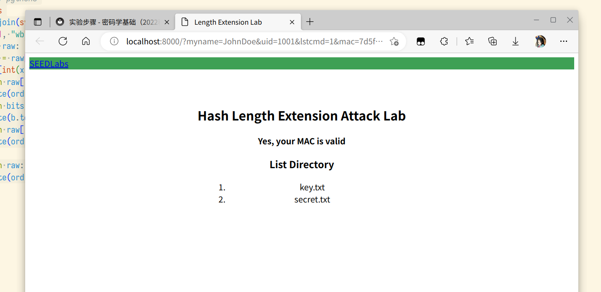
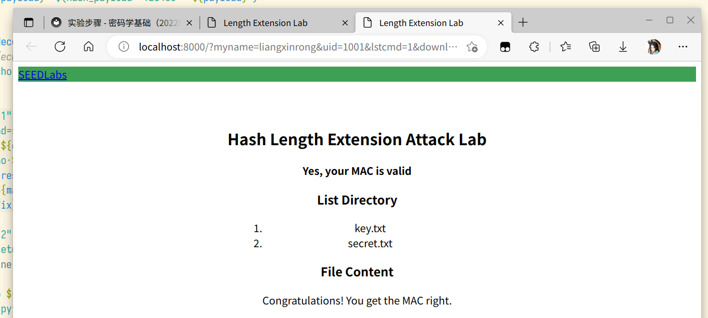
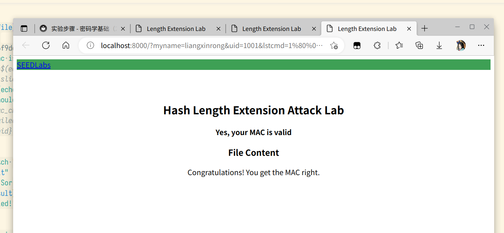
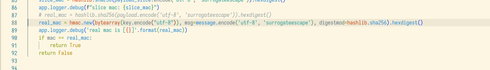
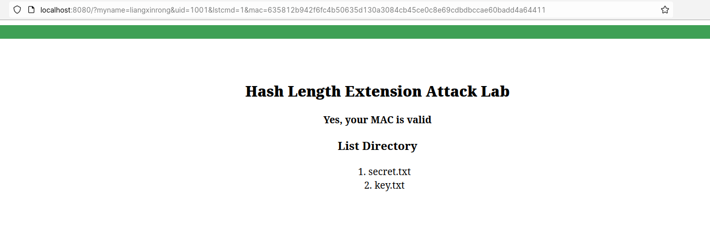
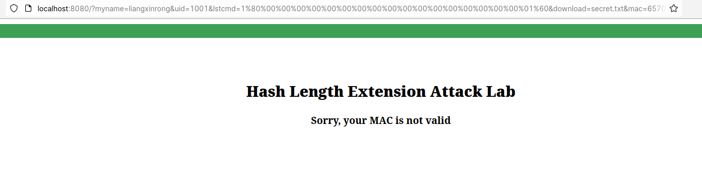

## 实验三 Hash长度扩展攻击

> 姓名：梁鑫嵘；学号：200110619

**一些辅助脚本**

`totext.py`

```python
#!/bin/env python3
import sys
from bs4 import BeautifulSoup as Soup

lines = sys.stdin.readlines()
print(Soup(''.join(lines), features="lxml").get_text().replace("\n\n", "\n").replace("\n\n", "\n"))
```

`urlencode.py`

```python
#!/bin/env python3
import sys
raw = ''.join(sys.stdin.readlines())#.replace("%80", "%ef%bf%bd")
f = open(1, "wb")
if '%' in raw:
  raw_url = raw[raw.index('%'):raw.rindex('%') + 3]
  bits = [int(x.strip(), 16) for x in raw_url.split("%") if len(x.strip()) > 0]
  for b in raw[:raw.index('%')]:
    f.write(ord(b).to_bytes(1, 'little'))
  for b in bits:
    f.write(b.to_bytes(1, 'little'))
  for b in raw[raw.rindex('%') + 3:]:
    f.write(ord(b).to_bytes(1, 'little'))
else:
  for b in raw:
    f.write(ord(b).to_bytes(1, 'little'))
```

### 数据准备阶段

```sh
#!/bin/zsh

echo "Preparing..."
if [ ! -f Labsetup.zip ]; then
# 下载实验包
curl "https://gitee.com/hitsz-cslab/cryptography-labs/raw/master/stupkt/lab3/Labsetup.zip" -O Labsetup.zip
fi
# 下载 compute_padding.py
if [ ! -f compute_padding.py ]; then
curl "https://gitee.com/hitsz-cslab/cryptography-labs/raw/master/stupkt/lab3/code-%E4%B8%8D%E8%83%BD%E6%89%A9%E6%95%A3%E5%88%B0%E7%BD%91%E4%B8%8A/compute_padding.py" -O compute_padding.py
fi
# 给 compute_padding.py 打个 patch，让它能够接收命令行参数
sed -i 's#^cmd = "myname=SEEDManual\&uid=1001\&lstcmd=1"#import sys; cmd = "myname=SEEDManual\&uid=1001\&lstcmd=1" if len(sys.argv) < 2 else sys.argv[1]#g' compute_padding.py
# 下载 url_length_extension.c
if [ ! -f url_length_extension.c ]; then
curl "https://gitee.com/hitsz-cslab/cryptography-labs/raw/master/stupkt/lab3/code-%E4%B8%8D%E8%83%BD%E6%89%A9%E6%95%A3%E5%88%B0%E7%BD%91%E4%B8%8A/url_length_extension.c" -O url_length_extension.c
fi
# 解压实验包
if [ ! -d Labsetup ]; then
unzip -o Labsetup.zip
fi
echo "Prepare done"

function fetch() {
  printf "Fetching url %s\n" $1
  curl -s "$1" | ./totext.py
}

# 在本地直接启动实验环境
# host=www.seedlab-hashlen.com
host=localhost
port=80
port=8000
prefix="http://${host}:${port}/?"
name=liangxinrong

echo "Starting flask environmemnt..."
FLASK_APP=./Labsetup/image_flask/app/www flask run --host ${host} --port ${port} & pid=$!
sleep 1
# echo "FLASK_APP=./Labsetup/image_flask/app/www flask run --host ${host} --port ${port}"
# read
echo "Environment startted to ${prefix}, pid = ${pid}"

echo "# Test"
fetch "${prefix}myname=JohnDoe&uid=1001&lstcmd=1&mac=7d5f750f8b3203bd963d75217c980d139df5d0e50d19d6dfdb8a7de1f8520ce3"
```

本阶段执行结果：

```Bash
Preparing...
Prepare done
Starting flask environmemnt...
 * Serving Flask app './Labsetup/image_flask/app/www'
 * Debug mode: off
WARNING: This is a development server. Do not use it in a production deployment. Use a production WSGI server instead.
 * Running on http://localhost:8000
Press CTRL+C to quit
Environment startted to http://localhost:8000/?, pid = 39879
# Test
Fetching url http://localhost:8000/?myname=JohnDoe&uid=1001&lstcmd=1&mac=7d5f750f8b3203bd963d75217c980d139df5d0e50d19d6dfdb8a7de1f8520ce3
127.0.0.1 - - [08/Nov/2022 11:36:47] "GET /?myname=JohnDoe&uid=1001&lstcmd=1&mac=7d5f750f8b3203bd963d75217c980d139df5d0e50d19d6dfdb8a7de1f8520ce3 HTTP/1.1" 200 -

Length Extension Lab

            SEEDLabs
        
Hash Length Extension Attack Lab
Yes, your MAC is valid
List Directory
key.txt
secret.txt
```

本阶段从网络上下载了实验必须的资源，并进行了网络测试。



### 任务1

请发送一个 download 命令到服务器,myname 的信息修改为你自己的姓名拼音,并且记录你得到的
响应内容(截图显示)。

```Bash
echo "# task 1"
cmd="&download=secret.txt"
res=$(hashme ${cmd})
payload=$(echo ${res} | awk '{print $1}')
mac=$(echo ${res} | awk '{print $2}')
echo "mac = ${mac}, payload = ${payload}, cmd = ${cmd}"
fetch "${prefix}${payload}&mac=${mac}"
```

```sh
# task 1
mac = 7a7f6be20c4cecd084670dd4500ada380534166849cfe5c981567661b6b326f6, payload = myname=liangxinrong&uid=1001&lstcmd=1&download=secret.txt, cmd = &download=secret.txt
Fetching url http://localhost:8000/?myname=liangxinrong&uid=1001&lstcmd=1&download=secret.txt&mac=7a7f6be20c4cecd084670dd4500ada380534166849cfe5c981567661b6b326f6
127.0.0.1 - - [08/Nov/2022 11:36:47] "GET /?myname=liangxinrong&uid=1001&lstcmd=1&download=secret.txt&mac=7a7f6be20c4cecd084670dd4500ada380534166849cfe5c981567661b6b326f6 HTTP/1.1" 200 -

Length Extension Lab

            SEEDLabs
        
Hash Length Extension Attack Lab
Yes, your MAC is valid
List Directory
key.txt
secret.txt
File Content
Congratulations! You get the MAC right.
```



### 任务2

为消息`<key>:myname=<name>&uid=<uid>&lstcmd=1`创建对应 padding,其中 `<key>` 和 `<uid>`
的实际内容应该从 `LabHome/key.txt` 文件中得到，`myname` 依然用你自己的姓名。

```sh
echo "# task 2"
kfile="./Labsetup/image_flask/app/LabHome/key.txt"
while read line
do
  args=$(echo ${line} | sed 's/:/ /g' | awk '{print "myname=" $2 "&uid=" $1 "&lstcmd=1"}')
	paddings=$(python3 compute_padding.py ${args})
  echo "${line} padding to: ${paddings}"
done < ${kfile}
```

结果：

```sh
# task 2
1001:123456 padding to: AAAAAA:myname=123456&uid=1001&lstcmd=1%80%00%00%00%00%00%00%00%00%00%00%00%00%00%00%00%00%00%00%00%00%00%00%00%01%30
1002:983abe padding to: AAAAAA:myname=983abe&uid=1002&lstcmd=1%80%00%00%00%00%00%00%00%00%00%00%00%00%00%00%00%00%00%00%00%00%00%00%00%01%30
1003:793zye padding to: AAAAAA:myname=793zye&uid=1003&lstcmd=1%80%00%00%00%00%00%00%00%00%00%00%00%00%00%00%00%00%00%00%00%00%00%00%00%01%30
1004:88zjxc padding to: AAAAAA:myname=88zjxc&uid=1004&lstcmd=1%80%00%00%00%00%00%00%00%00%00%00%00%00%00%00%00%00%00%00%00%00%00%00%00%01%30
1005:xciujk padding to: AAAAAA:myname=xciujk&uid=1005&lstcmd=1%80%00%00%00%00%00%00%00%00%00%00%00%00%00%00%00%00%00%00%00%00%00%00%00%01%30
```

### 任务3

```sh
echo "# task 3"
cmd="&download=secret.txt"
key_text=$(cat LabHome/key.txt)
uid="${key_text:0:4}"
key="${key_text:5:12}"
echo "uid is ${uid}, key is ${key}"
payload="myname=${name}&uid=${uid}&lstcmd=1"
paddings=$(python3 compute_padding.py ${payload})
paddings_decoded=$(urldecode "${paddings}")
echo "paddings: ${paddings}, decoded: ${paddings_decoded}"
payload_ext=$(echo "${paddings}" | sed "s/AAAAAA\://g")
echo "hash: ${key}:${payload_ext}"

mac0=$(echo -n "****************************************************************" | sha256sum | awk '{print $1}')
echo "original mac is ${mac0} hash("${key}":"${payload_ext}")"
i=1
# i=8
mkdir -p tests
proc_file="tests/url_length_extension_modifiled.c"
cp url_length_extension.c ${proc_file}
oiginal_words=(0x3912fe08 0x949c7c09 0xbd2825b0 0x1a2e8e9c 0x151d84be 0x0106e858 0x4e9006b8 0x8a22555f)
# mac is 64x4 bit, split to 8x uint32_t
while ((${#mac0} > 0))
do
  word=${mac0:0:8}
  echo "word ${oiginal_words[i]} (index ${i}) => word 0x${word} | ${mac0}"
  sed -i "s/${oiginal_words[i]}/0x${word}/g" "${proc_file}"
  # sed -i "s/${oiginal_words[i]}/0x0/g" "${proc_file}"
  declare -i i=${i}+1
  # declare -i i=${i}-1
  mac0=${mac0:8:64}
done
rm p3
gcc ${proc_file} -lcrypto -o p3 -Wno-deprecated-declarations
mac=$(./p3)
echo "new mac is ${mac}"
# mac_slice=$(echo -n "${key}:${payload_ext}" | python3 urldecode.py | sha256sum | awk '{print $1}')
# echo "mac slice: ${mac_slice} hash(${key}:${payload_ext})"
mac_check=$(echo -n "${key}:${payload_ext}${cmd}" | python3 urldecode.py | sha256sum | awk '{print $1}')
echo "mac should be ${mac_check} hash("${key}":"${payload_ext}${cmd}")"
# if [ "${mac_check}" != "${mac}" ]; then
#   echo "Failed!"
#   kill ${pid}
#   return
# fi
result=$(fetch "${prefix}${payload_ext}${cmd}&mac=${mac}")
echo "$result"
failed_msg="Sorry"
if [[ "${result}" =~ "${failed_msg}" ]]; then
  echo "Failed!"
  read
else
  echo "Can visit results now, enter to leave"
  read
fi
```

生成的 paddings:

```
123456:myname=liangxinrong&uid=1001&lstcmd=1%80%00%00%00%00%00%00%00%00%00%00%00%00%00%00%00%00%00%01%60&download=secret.txt
```

产生的 MAC: `6570b426f9dcf250193abd605d1dbc85296c04cb603ee590b44661121dcac0d7`

```sh
# task 3
uid is 1001, key is 123456
paddings: AAAAAA:myname=liangxinrong&uid=1001&lstcmd=1%80%00%00%00%00%00%00%00%00%00%00%00%00%00%00%00%00%00%01%60, decoded: AAAAAA:myname=liangxinrong&uid=1001&lstcmd=1�
hash: 123456:myname=liangxinrong&uid=1001&lstcmd=1%80%00%00%00%00%00%00%00%00%00%00%00%00%00%00%00%00%00%01%60
original mac is 4ac5b1038ff9a79b5ed7a8cbbb97f2b658871d6a02c0d12e1aec4bba51ec19d9 hash(123456:myname=liangxinrong&uid=1001&lstcmd=1%80%00%00%00%00%00%00%00%00%00%00%00%00%00%00%00%00%00%01%60)
word 0x3912fe08 (index 1) => word 0x4ac5b103 | 4ac5b1038ff9a79b5ed7a8cbbb97f2b658871d6a02c0d12e1aec4bba51ec19d9
word 0x949c7c09 (index 2) => word 0x8ff9a79b | 8ff9a79b5ed7a8cbbb97f2b658871d6a02c0d12e1aec4bba51ec19d9
word 0xbd2825b0 (index 3) => word 0x5ed7a8cb | 5ed7a8cbbb97f2b658871d6a02c0d12e1aec4bba51ec19d9
word 0x1a2e8e9c (index 4) => word 0xbb97f2b6 | bb97f2b658871d6a02c0d12e1aec4bba51ec19d9
word 0x151d84be (index 5) => word 0x58871d6a | 58871d6a02c0d12e1aec4bba51ec19d9
word 0x0106e858 (index 6) => word 0x02c0d12e | 02c0d12e1aec4bba51ec19d9
word 0x4e9006b8 (index 7) => word 0x1aec4bba | 1aec4bba51ec19d9
word 0x8a22555f (index 8) => word 0x51ec19d9 | 51ec19d9
new mac is 6570b426f9dcf250193abd605d1dbc85296c04cb603ee590b44661121dcac0d7
mac should be 6570b426f9dcf250193abd605d1dbc85296c04cb603ee590b44661121dcac0d7 hash(123456:myname=liangxinrong&uid=1001&lstcmd=1%80%00%00%00%00%00%00%00%00%00%00%00%00%00%00%00%00%00%01%60&download=secret.txt)
127.0.0.1 - - [08/Nov/2022 11:48:21] "GET /?myname=liangxinrong&uid=1001&lstcmd=1%80%00%00%00%00%00%00%00%00%00%00%00%00%00%00%00%00%00%01%60&download=secret.txt&mac=6570b426f9dcf250193abd605d1dbc85296c04cb603ee590b44661121dcac0d7 HTTP/1.1" 200 -
Fetching url http://localhost:8000/?myname=liangxinrong&uid=1001&lstcmd=1%80%00%00%00%00%00%00%00%00%00%00%00%00%00%00%00%00%00%01%60&download=secret.txt&mac=6570b426f9dcf250193abd605d1dbc85296c04cb603ee590b44661121dcac0d7

Length Extension Lab

            SEEDLabs
        
Hash Length Extension Attack Lab
Yes, your MAC is valid
File Content
Congratulations! You get the MAC right.
Can visit results now, enter to leave
```



### 任务4

修改代码，使用 HMAC 验证：



对请求

````myname=liangxinrong&uid=1001&lstcmd=1```

计算 HMAC：`635812b942f6fc4b50635d130a3084cb45ce0c8e69cdbdbccae60badd4a64411`

验证结果：



另外构造攻击请求：

````
http://localhost:8080/?myname=liangxinrong&uid=1001&lstcmd=1%80%00%00%00%00%00%00%00%00%00%00%00%00%00%00%00%00%00%01%60&download=secret.txt
````

其 MAC 为：`293175a6cdf28f126f0f0020f98120d197e9eb1dba173b5de48c73dea7255ee2`



攻击失败。

HMAC 通过将密钥与请求的哈希值再次拼接并哈希，规避了长度扩展攻击，无法通过上一次的哈希值和当前轮的加密值得到下一次的哈希值，因此更加安全。
