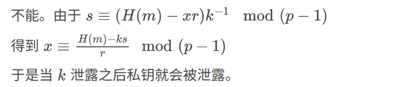

## 实验四 ElGamal数字签名算法

姓名：梁鑫嵘；学号：200110619

### 测试脚本

```Bash
#!/bin/sh

set -x

echo "密码学实验4"
cargo build

key="key"
file="data/lab4-message.txt"
fake="data/lab4-message-fake.txt"
# R_BASE="cargo run -- --binary -k $key"
R_BASE="./target/debug/elgamal --binary -k $key"
# R_BASE="cargo run -- -k $key"
R="$R_BASE -i $file"

rm $key*
sleep 1
echo "生成密钥对：$key $key.pub"
$R -m generate
sleep 1

echo "需要签名的信息：$(cat $file)"
echo "生成签名并验证 $key.sig"
$R -m sign
sleep 1
$R -m check
sleep 1

echo "再次生成签名并验证 $key.sig"
$R -m sign
sleep 1
$R -m check
sleep 1

echo "使用签名对修改后的消息（$(cat $fake)）进行验证："
$R_BASE -m check -i $fake || echo "验证确实没有通过，与预期相符" && exit
echo "验证通过了，与预期不符"
```

### 运行结果

```Bash
$ make
./scripts/lab4.sh
+ echo 密码学实验4
密码学实验4
+ cargo build
    Finished dev [unoptimized + debuginfo] target(s) in 0.05s
+ key=key
+ file=data/lab4-message.txt
+ fake=data/lab4-message-fake.txt
+ R_BASE='./target/debug/elgamal --binary -k key'
+ R='./target/debug/elgamal --binary -k key -i data/lab4-message.txt'
+ rm key key.pub key.sig
+ sleep 1
+ echo '生成密钥对：key key.pub'
生成密钥对：key key.pub
+ ./target/debug/elgamal --binary -k key -i data/lab4-message.txt -m generate
Done generation in 15 tries after 0 ms
Done generation in 15 tries after 1 ms
Done generation in 15 tries after 1 ms
Done generation in 15 tries after 1 ms
Done generation in 30 tries after 2 ms
Use cached prime: 3671
Use cached prime: 3209
Use cached prime: 3119
Use cached prime: 2441
Done generation in 15 tries after 1 ms
Done generation in 15 tries after 1 ms
Done generation in 15 tries after 1 ms
Done generation in 15 tries after 1 ms
Done generation in 30 tries after 2 ms
Use cached prime: 4057
Use cached prime: 3539
Use cached prime: 3967
generated key set: ElGamalKey { public: ElGamalPublicKey { p: 3539, g: 3967, y: 1127 }, private: ElGamalPrivateKey { x: 498 } }
Save key to file key key.pub
+ sleep 1
++ cat data/lab4-message.txt
+ echo 需要签名的信息：200110619
需要签名的信息：200110619
+ echo '生成签名并验证 key.sig'
生成签名并验证 key.sig
+ ./target/debug/elgamal --binary -k key -i data/lab4-message.txt -m sign
key: ElGamalKey { public: ElGamalPublicKey { p: 3539, g: 3967, y: 1127 }, private: ElGamalPrivateKey { x: 498 } }
k: 2395, sign: ElGamalSign { r: 777, s: 2429 }
Save sign to file key.sig
+ sleep 1
+ ./target/debug/elgamal --binary -k key -i data/lab4-message.txt -m check
1127^777 * 777^2429 mod 3539 =?= 3967^22977424211477309795363901701585821110548276144300779835609592092410642307685 mod 3539
left =?= right  |  1897 =?= 1897
Check passed!
+ sleep 1
+ echo '再次生成签名并验证 key.sig'
再次生成签名并验证 key.sig
+ ./target/debug/elgamal --binary -k key -i data/lab4-message.txt -m sign
key: ElGamalKey { public: ElGamalPublicKey { p: 3539, g: 3967, y: 1127 }, private: ElGamalPrivateKey { x: 498 } }
k: 3507, sign: ElGamalSign { r: 1897, s: 2439 }
Save sign to file key.sig
+ sleep 1
+ ./target/debug/elgamal --binary -k key -i data/lab4-message.txt -m check
1127^1897 * 1897^2439 mod 3539 =?= 3967^22977424211477309795363901701585821110548276144300779835609592092410642307685 mod 3539
left =?= right  |  1897 =?= 1897
Check passed!
+ sleep 1
++ cat data/lab4-message-fake.txt
+ echo 使用签名对修改后的消息（210110619）进行验证：
使用签名对修改后的消息（210110619）进行验证：
+ ./target/debug/elgamal --binary -k key -m check -i data/lab4-message-fake.txt
1127^1897 * 1897^2439 mod 3539 =?= 3967^32929311661715017773380381118760765605490075993510487624923746362441534548845 mod 3539
left =?= right  |  1897 =?= 401
Check failed!
Error: CheckError
+ echo 验证确实没有通过，与预期相符
验证确实没有通过，与预期相符
+ exit
$ 
```

### 截图

这里的截图即为上面运行结果的节选；加密解密使用的学号为 UTF-8 字符串格式。

1. 截图 2 组，公钥和私钥相同，选取的随机值 $k_1$ 和 $k_2$ 不同，用学号作为消息 $m$  , 打印输出内容 包括公钥$(y,p,g)$，私钥 $x$，签名结果 $(r,s)$ 以及验证结果。

   

2. 假设收到的消息 $m$ 被篡改了，打印输出发送时的消息 $m$ 和接收后被篡改的消息 $m’$ 以及验证签名失败的结果，并截图，公钥、私钥以及 $k$ 都可以用上面 1 中用到的值。

   

   这里用的是第二次生成的签名进行验证。

### 思考

1. 用 ElGamal 方案计算一个签名时，使用的随机数 $k$ 能不能泄露？请给出你的思考并分析原因。

   
   
   
   
   不能。由于 $s \equiv (H(m)-xr)k^{-1}\mod (p-1)$
   
   得到 $x\equiv \frac{H(m)-ks}{r}\mod (p-1)$
   
   于是当 $k$ 泄露之后私钥就会被泄露。

2. 如果采用相同的 $k$ 值来签名不同的两份消息，这样是否安全？请给出你的思考并分析原因。

   这样是不安全的，如果有两条不同的消息被同一个 $k$ 签名，则将泄露私钥。

   
   
   设 $(r,s_1),(r,s_2)$ 是用同一个 $k$ 签名的两个签名，有
   
   $r\equiv s^k \mod p$
   
   $s_1\equiv (H(m_1)-xr)k^{-1}\mod (p-1)$
   
   $s_2\equiv (H(m_2)-xr)k^{-1}\mod (p-1)$
   
   得到
   
   $xr\equiv H(m_1)-ks_1\mod (p-1)$
   
   $xr\equiv H(m_2)-ks_2\mod (p-1)$
   
   $0\equiv (H(m_1)-H(m_2))+k(s_2-s_1)\mod (p-1)$
   
   $k\equiv\frac{H(m_1)-H(m_2)}{s_1-s_2}\mod(p-1)$
   
   于是求出了 $k$，由思考 1 得知私钥被泄露了。

**附录**：程序命令行参数说明

```Bash
$ cargo run -- -h
    Finished dev [unoptimized + debuginfo] target(s) in 0.05s
     Running `target/debug/elgamal -h`
Usage: elgamal [OPTIONS]

Options:
  -m, --mode <MODE           Run mode [default: generate]
  -k, --key <KEY             Key path, generate/detect `path' and `path.pub' [default: key]
  -c, --comment <COMMENT     Attach comment to key files [default: "ELGAMAL-RS COMMENT"]
      --binary                 Output key in binary format
  -i, --input <INPUT         Input filename [default: stdin]
  -o, --output <OUTPUT       Output filename [default: stdout]
      --prime-min <PRIME_MIN Min prime bits [default: 10]
      --prime-max <PRIME_MAX Max prime bits [default: 12]
  -r, --rounds <ROUNDS       Miller Rabin calculate rounds [default: 10]
      --time-max <TIME_MAX   Max time in mill seconds that trying to generate a prime [default: 1000]
  -s, --silent                 Disable log output
      --retry                  Retry when failed to generate primes
  -t, --threads <THREADS     Calculate in <THREADSthreads [default: 5]
  -h, --help                   Print help information
$ 
```

